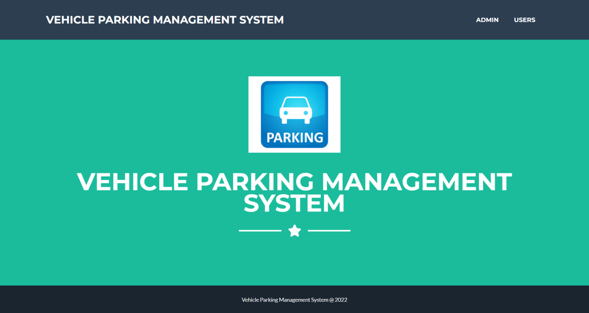
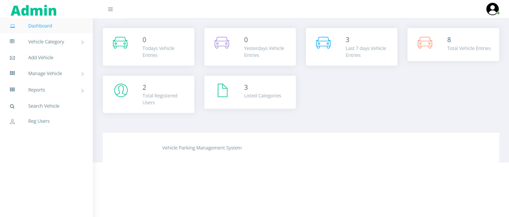
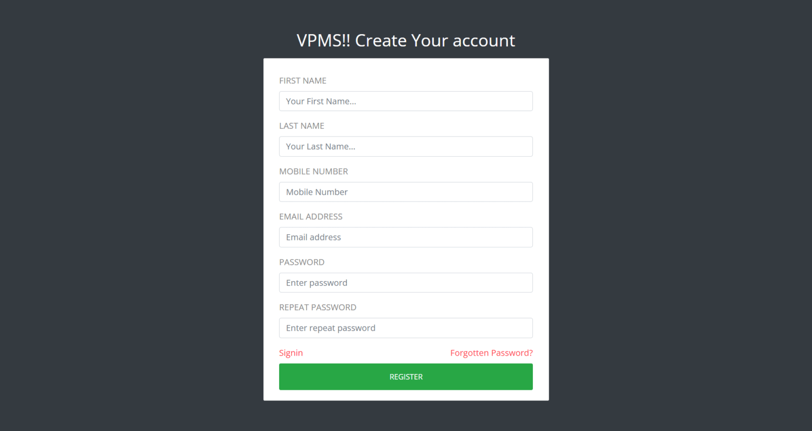

# 🚗 Vehicle Parking Management System (VPMS)

This is a web-based project developed as part of **Project-Based Learning (PBL)** in the second year of engineering. The objective of the project was to understand and implement the fundamentals of web development by creating a functional vehicle parking system. This system helps manage incoming and outgoing vehicles in a parking area, storing records systematically and allowing easy retrieval based on vehicle numbers.

---

## 📌 Project Overview

- **Project Title:** Vehicle Parking Management System  
- **Purpose:** Educational (PBL - 2nd Year Engineering Project)  
- **Team Size:** 4 members  
- **Development Type:** Customization and implementation of a vehicle parking concept using open-source technologies  

---

## 🛠️ Technologies Used

- **Frontend:** HTML, CSS, JavaScript, jQuery, AJAX  
- **Backend:** PHP  
- **Database:** MySQL  
- **Platform:** XAMPP 
---

## 📋 Key Modules

### 👨‍💼 Admin Panel
- Dashboard with vehicle entry summary
- Manage vehicle categories
- Add vehicle records
- Manage entry/exit, parking charges, and remarks
- Search vehicle by parking number
- Generate reports between dates
- Admin profile and password management

### 🙋‍♂️ User Panel
- User registration and login
- View personal vehicle parking records
- Update profile and reset password

---

## 🧪 How to Run the Project

1. Copy the `vpms` folder to your server root directory:
   - XAMPP: `htdocs`
   - WAMP: `www`
   - LAMP: `var/www/html`
2. Open [phpMyAdmin](http://localhost/phpmyadmin)
3. Create a database named `vpmsdb`
4. Import the file `vpmsdb.sql` into the database
5. Run the application in your browser:  
   ➤ [http://localhost/vpms](http://localhost/vpms)

---

## 🔐 Test Credentials

### Admin Login:
- **Username:** admin  
- **Password:** Test@123  

### User Login:
- **Username:** 1234567890  
- **Password:** Test@123  
(Users can also register their own account.)

---

## 📸 Screenshots

### 🏠 Home Page

### 📊 Admin Dashboard

### 📝 Vehicle Entry Form

### 🚗 User Vehicle Records

---

## 📄 Disclaimer

This project was developed for educational purposes only as a part of Project-Based Learning. It was created by a team of four students in the second year of engineering. Some references and inspiration were taken from existing open-source parking system concepts.

---

## 👩‍💻 Contributors

- Anushka Salve  

---

